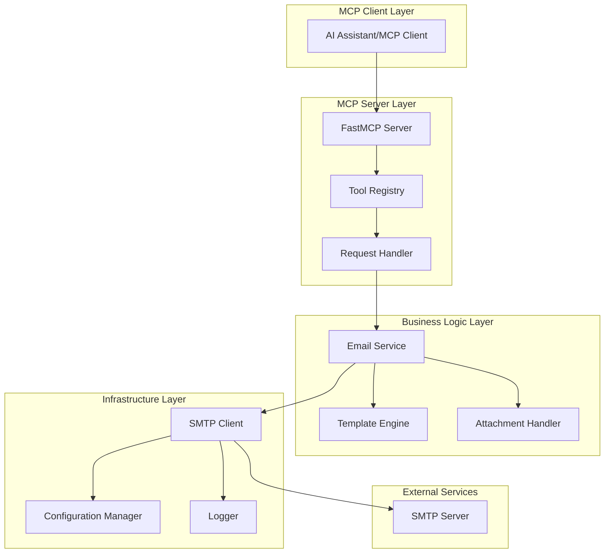

# Design Document: SMTP MCP Server

## Overview

This design document outlines the implementation of a Python-based MCP (Model Context Protocol) server that provides SMTP email functionality. The system will use the FastMCP framework to expose email sending capabilities through standardized MCP tools, enabling AI assistants to send emails via SMTP servers with proper authentication, encryption, and error handling.

The server will be built as a single-file implementation in `server.py` with a main entry point that starts the MCP server and exposes email-related tools to MCP clients.

## Architecture

The system follows a layered architecture with clear separation of concerns:



### Key Architectural Principles

1. **Single Responsibility**: Each component has a focused, well-defined purpose
2. **Dependency Injection**: Configuration and dependencies are injected rather than hardcoded
3. **Error Isolation**: Failures in one component don't cascade to others
4. **Protocol Compliance**: Strict adherence to MCP protocol specifications

## Components and Interfaces

### FastMCP Server Component

The main server component built using the FastMCP framework:

```python
from fastmcp import FastMCP

mcp = FastMCP("smtp-server")

@mcp.tool()
async def send_email(
    to: str,
    subject: str,
    body: str,
    from_email: str = None,
    cc: str = None,
    bcc: str = None,
    html: bool = False,
    attachments: list = None,
    template_vars: dict = None
) -> dict:
    """Send an email via SMTP"""
    pass
```

**Responsibilities:**
- Handle MCP protocol communication
- Validate incoming requests
- Route requests to appropriate business logic
- Format responses according to MCP standards

### Email Service Component

Core business logic for email operations:

```python
class EmailService:
    def __init__(self, smtp_client: SMTPClient, template_engine: TemplateEngine):
        self.smtp_client = smtp_client
        self.template_engine = template_engine
    
    async def send_email(self, email_request: EmailRequest) -> EmailResponse:
        """Process and send email with all business logic"""
        pass
    
    def validate_email_request(self, request: EmailRequest) -> ValidationResult:
        """Validate email parameters"""
        pass
```

**Responsibilities:**
- Orchestrate email sending workflow
- Apply business rules and validation
- Handle template processing
- Coordinate with SMTP client

### SMTP Client Component

Low-level SMTP communication handler:

```python
class SMTPClient:
    def __init__(self, config: SMTPConfig):
        self.config = config
        self.connection = None
    
    async def connect(self) -> bool:
        """Establish SMTP connection with authentication"""
        pass
    
    async def send_message(self, message: EmailMessage) -> str:
        """Send email message and return message ID"""
        pass
    
    async def disconnect(self):
        """Clean up SMTP connection"""
        pass
```

**Responsibilities:**
- Manage SMTP server connections
- Handle authentication (plain, OAuth2)
- Support SSL/TLS encryption
- Implement connection pooling and retry logic

### Template Engine Component

Handle email template processing:

```python
class TemplateEngine:
    def process_template(self, template: str, variables: dict) -> str:
        """Process template with variable substitution"""
        pass
    
    def validate_template(self, template: str) -> bool:
        """Validate template syntax"""
        pass
```

**Responsibilities:**
- Variable substitution in email content
- Template syntax validation
- Support for conditional content

### Configuration Manager Component

Handle server configuration:

```python
class SMTPConfig:
    host: str
    port: int
    username: str
    password: str
    use_tls: bool
    use_ssl: bool
    timeout: int = 30
    
    @classmethod
    def from_env(cls) -> 'SMTPConfig':
        """Load configuration from environment variables"""
        pass
```

**Responsibilities:**
- Load configuration from environment variables
- Validate configuration parameters
- Provide default values for optional settings

## Data Models

### Email Request Model

```python
from dataclasses import dataclass
from typing import List, Optional, Dict

@dataclass
class EmailRequest:
    to: str
    subject: str
    body: str
    from_email: Optional[str] = None
    cc: Optional[str] = None
    bcc: Optional[str] = None
    html: bool = False
    attachments: Optional[List[Attachment]] = None
    template_vars: Optional[Dict[str, str]] = None
```

### Email Response Model

```python
@dataclass
class EmailResponse:
    success: bool
    message_id: Optional[str] = None
    error: Optional[str] = None
    details: Optional[Dict] = None
```

### Attachment Model

```python
@dataclass
class Attachment:
    filename: str
    content: bytes
    mime_type: str
    content_id: Optional[str] = None
```

### SMTP Configuration Model

```python
@dataclass
class SMTPConfig:
    host: str
    port: int
    username: str
    password: str
    use_tls: bool = True
    use_ssl: bool = False
    timeout: int = 30
    max_retries: int = 3
```

## Correctness Properties

*A property is a characteristic or behavior that should hold true across all valid executions of a system-essentially, a formal statement about what the system should do. Properties serve as the bridge between human-readable specifications and machine-verifiable correctness guarantees.*

### Property 1: SMTP Authentication Success
*For any* valid SMTP credentials (username, password, server configuration), authentication should succeed and establish a secure connection.
**Validates: Requirements 1.2**

### Property 2: Connection Error Descriptiveness
*For any* invalid SMTP server configuration or network failure, the error message returned should contain specific details about the failure cause.
**Validates: Requirements 1.3**

### Property 3: Multi-Server Configuration Support
*For any* set of valid SMTP server configurations, the client should be able to switch between them without losing functionality.
**Validates: Requirements 1.4**

### Property 4: Email Request Validation
*For any* email request with missing required fields (to, subject, or body), the validation should fail with specific field error messages.
**Validates: Requirements 2.1**

### Property 5: Plain Text Email Formatting
*For any* plain text email content, the message should be formatted with Content-Type: text/plain and proper character encoding.
**Validates: Requirements 2.2**

### Property 6: HTML Email Formatting
*For any* HTML email content, the message should be formatted with Content-Type: text/html and proper character encoding preservation.
**Validates: Requirements 2.3**

### Property 7: Multi-Recipient Delivery
*For any* email with multiple recipients in TO, CC, and BCC fields, all recipients should receive the email without duplication or omission.
**Validates: Requirements 2.4**

### Property 8: Success Response Format
*For any* successfully sent email, the response should include a success flag and a valid message ID.
**Validates: Requirements 2.5**

### Property 9: Error Response Detail
*For any* failed email sending operation, the response should include detailed error information and failure reason.
**Validates: Requirements 2.6**

### Property 10: Attachment Base64 Encoding
*For any* email attachment, the content should be properly base64 encoded in the message body.
**Validates: Requirements 3.1**

### Property 11: MIME Type Header Setting
*For any* attachment with a specified MIME type, the Content-Type header should be set correctly.
**Validates: Requirements 3.2**

### Property 12: Filename Header Inclusion
*For any* attachment with a filename, the Content-Disposition header should include the filename parameter.
**Validates: Requirements 3.3**

### Property 13: Multiple Attachment Support
*For any* email with multiple attachments, all attachments should be properly encoded and included in the message.
**Validates: Requirements 3.5**

### Property 14: Parameter Validation Error Messages
*For any* invalid parameters provided to MCP tools, the server should return structured validation error messages.
**Validates: Requirements 4.3**

### Property 15: MCP Protocol Compliance
*For any* MCP request or response, the formatting should comply with MCP protocol standards.
**Validates: Requirements 4.4**

### Property 16: Concurrent Request Safety
*For any* set of concurrent email requests, the server should handle them without data corruption or race conditions.
**Validates: Requirements 4.5**

### Property 17: Configuration Validation Error Messages
*For any* missing required configuration parameter, the server should return clear error messages indicating which parameters are missing.
**Validates: Requirements 5.2**

### Property 18: Dynamic Reconfiguration Support
*For any* configuration change during runtime, the server should allow reconnection without requiring a restart.
**Validates: Requirements 5.4**

### Property 19: Startup Configuration Validation
*For any* invalid configuration parameters, the server should detect and report validation errors during startup.
**Validates: Requirements 5.5**

### Property 20: SMTP Error Logging Detail
*For any* SMTP operation error, the system should log detailed error information including error codes and descriptions.
**Validates: Requirements 6.1**

### Property 21: Success Operation Logging
*For any* successful email operation, the system should log confirmation messages with relevant details.
**Validates: Requirements 6.2**

### Property 22: Structured Error Response Format
*For any* invalid request, the server should return a structured error response with consistent formatting.
**Validates: Requirements 6.3**

### Property 23: Network Timeout Handling
*For any* network timeout during SMTP operations, the server should handle it gracefully with appropriate error messages.
**Validates: Requirements 6.4**

### Property 24: Sensitive Information Sanitization
*For any* log entry containing sensitive information (passwords, tokens), the sensitive data should be sanitized or redacted.
**Validates: Requirements 6.5**

### Property 25: Template Variable Substitution
*For any* email template with variables and corresponding values, all variables should be correctly substituted in both subject and body.
**Validates: Requirements 7.1**

### Property 26: Missing Template Variable Error
*For any* template with undefined variables, the system should return error messages indicating which variables are missing.
**Validates: Requirements 7.2**

### Property 27: Template Feature Support
*For any* template using simple string substitution or conditional content, both features should work correctly.
**Validates: Requirements 7.3**

### Property 28: HTML Template Preservation
*For any* HTML template, the formatting and structure should be preserved after variable substitution.
**Validates: Requirements 7.4**

### Property 29: Template Syntax Validation
*For any* template with invalid syntax, the system should validate and reject it before processing.
**Validates: Requirements 7.5**

## Error Handling

The system implements comprehensive error handling at multiple levels:

### SMTP Connection Errors
- **Connection Timeout**: Retry with exponential backoff, maximum 3 attempts
- **Authentication Failure**: Return specific error codes (invalid credentials, account locked, etc.)
- **SSL/TLS Errors**: Provide detailed certificate and encryption error information
- **Server Unavailable**: Distinguish between temporary and permanent failures

### Email Validation Errors
- **Invalid Email Addresses**: Use regex validation and provide specific format guidance
- **Missing Required Fields**: Return field-specific error messages
- **Content Size Limits**: Enforce configurable limits for body and attachments
- **Attachment Errors**: Handle unsupported MIME types and encoding failures

### MCP Protocol Errors
- **Malformed Requests**: Return structured error responses with request validation details
- **Tool Not Found**: Provide available tool listings in error responses
- **Parameter Type Errors**: Include expected vs. actual type information
- **Concurrent Request Limits**: Implement request queuing with overflow handling

### Configuration Errors
- **Missing Environment Variables**: List all required variables in error messages
- **Invalid Configuration Values**: Provide valid ranges and examples
- **Runtime Configuration Changes**: Validate before applying, rollback on failure

### Error Response Format
All errors follow a consistent structure:
```json
{
  "success": false,
  "error": {
    "code": "SMTP_AUTH_FAILED",
    "message": "Authentication failed for user@example.com",
    "details": {
      "smtp_code": 535,
      "smtp_message": "Authentication credentials invalid"
    }
  }
}
```

## Testing Strategy

The testing strategy employs a dual approach combining unit tests for specific scenarios and property-based tests for comprehensive coverage.

### Unit Testing Approach
Unit tests focus on specific examples, edge cases, and integration points:

- **Configuration Loading**: Test environment variable parsing and validation
- **SMTP Connection**: Test specific server configurations (Gmail, Outlook, custom)
- **Email Formatting**: Test specific email formats and encoding scenarios
- **Error Conditions**: Test specific failure scenarios and error message formats
- **MCP Integration**: Test tool registration and request/response handling

### Property-Based Testing Approach
Property-based tests verify universal properties across randomized inputs using the **Hypothesis** library:

- **Minimum 100 iterations** per property test to ensure comprehensive coverage
- **Custom generators** for email addresses, SMTP configurations, and message content
- **Shrinking support** to find minimal failing examples when properties fail
- **Stateful testing** for connection lifecycle and concurrent operations

### Test Configuration
Each property-based test will be configured as follows:
```python
from hypothesis import given, strategies as st, settings

@settings(max_examples=100, deadline=None)
@given(email_request=email_request_strategy())
def test_email_validation_property(email_request):
    """Feature: smtp-mcp-server, Property 4: Email Request Validation"""
    # Test implementation
```

### Test Data Generation
Smart generators will be implemented for:
- **Valid/Invalid Email Addresses**: Using realistic patterns and edge cases
- **SMTP Configurations**: Covering common providers and custom setups
- **Email Content**: Including Unicode, HTML, and plain text variations
- **Attachment Data**: Various file types, sizes, and encoding scenarios

### Integration Testing
- **End-to-End Email Flow**: From MCP request to SMTP delivery
- **Multi-Server Scenarios**: Testing server switching and failover
- **Concurrent Operations**: Stress testing with multiple simultaneous requests
- **Configuration Changes**: Testing dynamic reconfiguration scenarios

### Test Environment Setup
- **Mock SMTP Servers**: For testing without external dependencies
- **Real SMTP Testing**: Using test email services for integration validation
- **Environment Isolation**: Separate test configurations and credentials
- **Continuous Integration**: Automated testing on code changes

The testing strategy ensures both correctness of specific implementations and robustness across the full input space, providing confidence in the system's reliability and compliance with requirements.